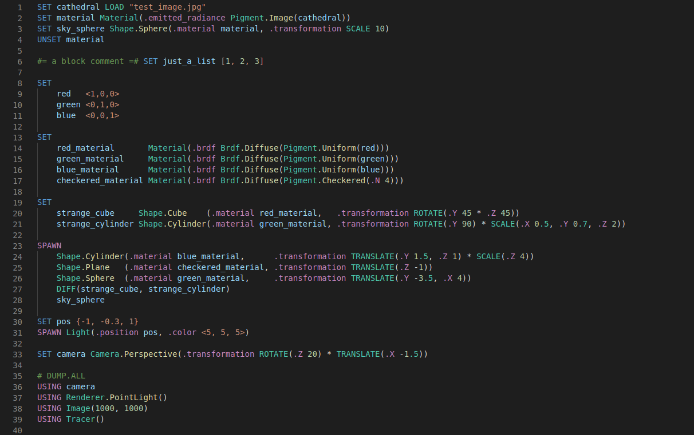

# SceneLang Highlighter

This extension provides syntax highlighting for the SceneLang Domain-Specific Language (DSL), as defined at the Julia package [Raytracer.jl](https://github.com/Paolo97Gll/Raytracer.jl). We suggest to check its documentation section about the language.

## Features

- Syntax Highliting
	- Distinguishes scene-related commands, instruction commands, and construction commands 
	- marks as invalid all non-existing commands
	- Distinguishes type-extension keywords, attribute keywords, and command extension keywords
	- marks as invalid all non-constructing keywords following a lowercase letter

> **Note:** for devevelopers. If any commands are added to the language add them in the `syntaxes/scenelang.tmLanguage.json` file too.

Here reported is a screenshot of how the syntax highlighting would appear when using the `Dark+` VSCode theme.

> Tip: Many popular extensions utilize animations. This is an excellent way to show off your extension! We recommend short, focused animations that are easy to follow.

## Release Notes

### 0.1.0

Initial release
